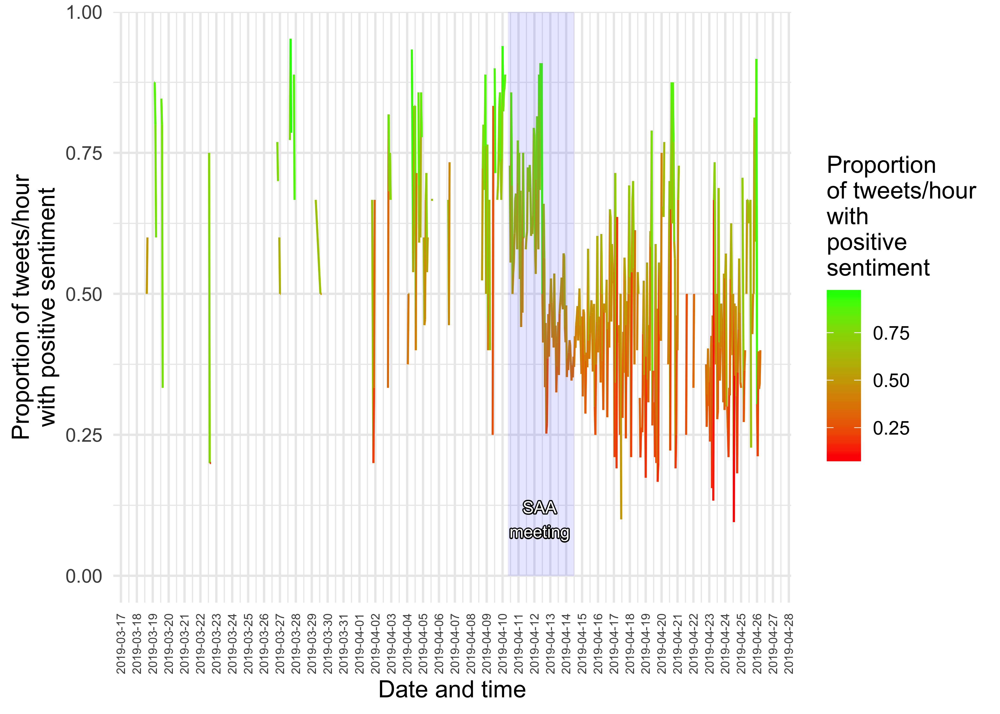

Preliminary exploration of tweets relating the 2019 Society of American
Archaeology annual meeting
================
Ben Marwick
01 August, 2019

<!-- README.md is generated from README.Rmd. Please edit that file -->

<!-- badges: start -->

[](https://mybinder.org/v2/gh/benmarwick/saa2019-tweets/master?urlpath=rstudio)
<!-- badges: end -->

The goal of saa2019-tweets is to explore tweets posted about the Society
of American Archaeology annual meeting in 2019. More specfically, we are
looking at tweets that include the hashtag \#SAA2019. For an interactive
exploration of this R code and data without downloading anything, click
[Launch RStudio
binder](https://mybinder.org/v2/gh/benmarwick/saa2019-tweets/master?urlpath=rstudio)
to launch an instance of RStudio in your browser the includes the code
and data in an environment that can run the code.

The 2019 meeting was notable because of the controversial handling of
David Yesner’s presence at the meeting. Yesner is an archaeologist
banned from his university’s campus for sexual harassment. More details
can be found in *Science*
([1](https://www.sciencemag.org/news/2019/04/metoo-controversy-erupts-archaeology-meeting),
[2](https://www.sciencemag.org/news/2019/04/archaeological-society-tries-stem-continuing-controversy-over-metoo-scandal))
and *The Scientist*
([1](https://www.the-scientist.com/news-opinion/an-archaeology-meeting-finds-itself-in-the-middle-of--metoostem-65737)).

# Acquire the tweets from the TAGS Google sheet

We do this once, and then store the results locally for future
reference.

``` r
library(googlesheets)
library(tidyverse)

tags_sheet <- "https://docs.google.com/spreadsheets/d/17EOoOeGllBxk5x9TS3vEc0zdUwmh_fL0abdEdrOz1Pg/edit#gid=400689247"

saa2019_tweet_archive <- 
tags_sheet %>% 
  gs_url() %>% 
    gs_read(ws = "Archive")

# save a local copy
write_csv(saa2019_tweet_archive,
          "data/saa2019_tweet_archive.csv")
```

# Volume of tweets over time

The table inset in the plot shows the ten most retweeted tweets during
the two hours of the highest volume of tweets.

``` r
library(tidyverse)
library(lubridate)
#> 
#> Attaching package: 'lubridate'
#> The following object is masked from 'package:base':
#> 
#>     date
library(gridExtra)
#> 
#> Attaching package: 'gridExtra'
#> The following object is masked from 'package:dplyr':
#> 
#>     combine
library(shadowtext)

saa2019_tweet_archive <- 
read_csv("data/saa2019_tweet_archive.csv")
#> Parsed with column specification:
#> cols(
#>   id_str = col_double(),
#>   from_user = col_character(),
#>   text = col_character(),
#>   created_at = col_character(),
#>   time = col_character(),
#>   geo_coordinates = col_logical(),
#>   user_lang = col_character(),
#>   in_reply_to_user_id_str = col_double(),
#>   in_reply_to_screen_name = col_character(),
#>   from_user_id_str = col_double(),
#>   in_reply_to_status_id_str = col_double(),
#>   source = col_character(),
#>   profile_image_url = col_character(),
#>   user_followers_count = col_double(),
#>   user_friends_count = col_double(),
#>   user_location = col_character(),
#>   status_url = col_character(),
#>   entities_str = col_character()
#> )

saa2019_tweet_archive_dttm <- 
saa2019_tweet_archive %>% 
  mutate(time_dttm = dmy_hms(time)) %>% 
  group_by(hour = floor_date(time_dttm, "hour")) 

saa2019_tweet_archive_dttm_hourly_counts <- 
saa2019_tweet_archive_dttm %>% 
  count()  

top_hours <- 
  saa2019_tweet_archive_dttm_hourly_counts %>% 
  arrange(desc(n)) %>% 
  ungroup %>% 
  slice(1:2)

saa2019_tweet_archive_dttm_top_hours <- 
saa2019_tweet_archive_dttm %>% 
  filter(hour %in% top_hours$hour) %>% 
  group_by(text) %>% 
  count(sort = TRUE) %>% 
  ungroup %>%
  mutate(text = str_wrap(text, 100)) %>% 
  slice(1:10)

saa2019_tweet_archive_dttm_hourly_counts_plot <- 
  ggplot(saa2019_tweet_archive_dttm_hourly_counts,
         aes(hour, n)) +
  geom_line() +
  geom_vline(xintercept = top_hours$hour,
             colour = "red") +
  theme_minimal(base_size = 12) +
  scale_x_datetime(date_breaks = "1 day") +
  theme(axis.text.x = element_text(angle = 90, 
                                   hjust = 1, 
                                   vjust = 0.5,
                                   size = 6)) +
  labs(y = "Number of tweets per hour",
       x = "Date and time") +
  annotation_custom(tableGrob(saa2019_tweet_archive_dttm_top_hours,
                              rows=NULL,
                              theme = ttheme_default(base_size = 4)), 
                    xmin= ymd_hms("2019-03-18 16:00:00 UTC"), 
                    xmax= ymd_hms("2019-04-08 16:00:00 UTC"), 
                    ymin= 250, 
                    ymax= 100) +
    # shade SAA meeting days | April 10 - 14, 2019.
    annotate("rect", 
             xmin = ymd_hms("2019-04-10 08:00:00 UTC"),
             xmax = ymd_hms("2019-04-14 12:00:00 UTC"), 
             ymin = 0, 
             ymax = Inf, 
             alpha = 0.1,  
             fill = "blue") +
  geom_shadowtext(aes(label="SAA\nmeeting",
                      x = ymd_hms("2019-04-12 08:00:00 UTC"),
                      y = 310), size=3)

saa2019_tweet_archive_dttm_hourly_counts_plot
```


# Number of Twitter accounts using \#SAA2019

The total number of unique accounts in this data set is 3325.

Here are the top 50 twitter accounts in these data:

``` r
library(tidyverse)
#> ── Attaching packages ─────────────────────────────────────────────────────────────────────────────── tidyverse 1.2.1 ──
#> ✔ ggplot2 3.2.0     ✔ purrr   0.3.2
#> ✔ tibble  2.1.3     ✔ dplyr   0.8.1
#> ✔ tidyr   0.8.3     ✔ stringr 1.4.0
#> ✔ readr   1.3.1     ✔ forcats 0.4.0
#> ── Conflicts ────────────────────────────────────────────────────────────────────────────────── tidyverse_conflicts() ──
#> ✖ dplyr::filter() masks stats::filter()
#> ✖ dplyr::lag()    masks stats::lag()
saa2019_tweet_archive_dttm_accounts_count <- 
  saa2019_tweet_archive_dttm %>% 
  ungroup %>% 
  count(from_user, sort = TRUE) 

saa2019_tweet_archive_dttm_accounts_count %>% 
  slice(1:50) %>% 
ggplot(aes(reorder(from_user, n), n)) +
  geom_col() +
  coord_flip() +
  theme_minimal(base_size = 10) +
  labs(y = "Number of tweets",
       x = "Top 50 Twitter accounts by volume") 
```


Here is the count of all twitter accounts active in each hour:

``` r
saa2019_tweet_archive_dttm_accounts <- 
  saa2019_tweet_archive_dttm %>% 
  group_by(hour) %>% 
  summarise(n_accounts = n_distinct(from_user))

  ggplot(saa2019_tweet_archive_dttm_accounts,
         aes(hour, n_accounts)) +
  geom_line() +
  theme_minimal(base_size = 12) +
  scale_x_datetime(date_breaks = "1 day") +
  theme(axis.text.x = element_text(angle = 90, 
                                   hjust = 1, 
                                   vjust = 0.5,
                                   size = 6)) +
  labs(y = "Number of unique Twitter accounts posting per hour",
       x = "Date and time")   +
# shade SAA meeting days | April 10 - 14, 2019.
    annotate("rect", 
             xmin = ymd_hms("2019-04-10 08:00:00 UTC"),
             xmax = ymd_hms("2019-04-14 12:00:00 UTC"), 
             ymin = 0, 
             ymax = Inf, 
             alpha = 0.1,  
             fill = "blue")  +
  geom_shadowtext(aes(label="SAA\nmeeting",
                      x = ymd_hms("2019-04-12 08:00:00 UTC"),
                      y = 180), size=3)
```


# Sentiment analysis

Sentiment analysis of tweets containing the \#saa2019 hashtag posted
during March-April 2019. Sentiment gradually trends upwards before the
meeting, followed by a steep decline during the meeting. After the
meeting there is very high variance in sentiment.

``` r
library(tidytext)

saa2019_tweet_archive_dttm_sentiment <- 
saa2019_tweet_archive_dttm %>% 
  ungroup %>% 
  # filter(time_dttm >= "2019-04-11 00:00:00" & time_dttm <= "2019-04-17 00:00:00" ) %>%
  select(text, hour) %>%
  mutate(text = str_remove(text, "\\brt\\b|\\bRT\\b|\\s?(f|ht)(tp)(s?)(://)([^\\.]*)[\\.|/](\\S*)|https://*")) %>% 
  mutate(text = tm::removeWords(text, c(stop_words$word, "the", "The")))  %>%
  unnest_tokens(word, text) %>% 
   inner_join(get_sentiments("bing") %>% 
   filter(sentiment %in% c("positive",  "negative"))) 
#> Joining, by = "word"

saa2019_tweet_archive_dttm_sentiment_tally <- 
saa2019_tweet_archive_dttm_sentiment %>% 
  group_by(hour, sentiment) %>% 
  tally() %>% 
  spread(sentiment, n) %>% 
  mutate(prop_positive_sentiment  = positive / (negative + positive) )

ggplot() +
  geom_line(data = saa2019_tweet_archive_dttm_sentiment_tally,
           aes(hour, prop_positive_sentiment,
           colour = prop_positive_sentiment))  +
  scale_color_continuous(low = "red", 
                         high = "green", 
                         name = "Proportion\nof tweets/hour\nwith \npositive\nsentiment") +
  labs(y = "Proportion of tweets/hour\nwith positive sentiment",
       x = "Date and time") + 
  scale_x_datetime(date_breaks = "1 day") +
  theme_minimal(base_size = 12) +
  theme(axis.text.x = element_text(angle = 90, 
                                   hjust = 1, 
                                   vjust = 0.5,
                                   size = 6))   +
# shade SAA meeting days | April 10 - 14, 2019.
    annotate("rect", 
             xmin = ymd_hms("2019-04-10 08:00:00 UTC"),
             xmax = ymd_hms("2019-04-14 12:00:00 UTC"), 
             ymin = 0, 
             ymax = Inf, 
             alpha = 0.1,  
             fill = "blue") +
  geom_shadowtext(aes(label="SAA\nmeeting",
                      x = ymd_hms("2019-04-12 08:00:00 UTC"),
                      y = 0.1), size=3)
#> Warning: Removed 4 rows containing missing values (geom_path).
```



World cloud organised by sentiment

``` r
library(tidytext)
library(reshape2)
#> 
#> Attaching package: 'reshape2'
#> The following object is masked from 'package:tidyr':
#> 
#>     smiths
library(wordcloud)
#> Loading required package: RColorBrewer

saa2019_tweet_archive_dttm_sentiment %>%
  count(word, sentiment, sort = TRUE) %>%
  acast(word ~ sentiment, value.var = "n", fill = 0) %>%
  comparison.cloud(colors = c("gray20", "gray80"),
                   max.words = 100)
```


# Co-occuring words

``` r
library(tidytext)
library(igraph)
#> 
#> Attaching package: 'igraph'
#> The following objects are masked from 'package:dplyr':
#> 
#>     as_data_frame, groups, union
#> The following objects are masked from 'package:purrr':
#> 
#>     compose, simplify
#> The following object is masked from 'package:tidyr':
#> 
#>     crossing
#> The following object is masked from 'package:tibble':
#> 
#>     as_data_frame
#> The following objects are masked from 'package:stats':
#> 
#>     decompose, spectrum
#> The following object is masked from 'package:base':
#> 
#>     union
library(ggraph)

saa2019_tweet_archive_dttm %>% 
  ungroup %>% 
  filter(time_dttm >= "2019-04-11 00:00:00" & time_dttm <= "2019-04-17 00:00:00" ) %>%
  select(text) %>%
  mutate(text = str_remove(text, "\\brt\\b|\\bRT\\b|\\s?(f|ht)(tp)(s?)(://)([^\\.]*)[\\.|/](\\S*)|https://*")) %>% 
  mutate(text = tm::removeWords(text, c(stop_words$word, "the", "The", "2019"))) %>%
  unnest_tokens(paired_words, text, token = "ngrams", n = 2) %>% 
  separate(paired_words, c("word1", "word2"), sep = " ") %>% 
  count(word1, word2, sort = TRUE) %>% 
  filter(n >= 100) %>%
  graph_from_data_frame() %>%
  ggraph(layout = "fr") +
  geom_edge_link(aes(edge_alpha = n, edge_width = n)) +
  geom_node_point(color = "darkslategray4", size = 3) +
  geom_node_text(aes(label = name), vjust = 1.8, size = 3) +
  labs(title = "Word Network for #SAA2019 tweets",
       x = "", y = "") +
  theme_void()
```


## Colophon

This document was written in R Markdown. The code and data for this
document is online at <https://github.com/benmarwick/saa2019-tweets>.

This document was generated on 2019-08-01 10:25:14 using the following
computational environment and dependencies:

``` r
sessioninfo::session_info()
#> ─ Session info ──────────────────────────────────────────────────────────
#>  setting  value                       
#>  version  R version 3.6.0 (2019-04-26)
#>  os       macOS Mojave 10.14.5        
#>  system   x86_64, darwin15.6.0        
#>  ui       X11                         
#>  language (EN)                        
#>  collate  en_US.UTF-8                 
#>  ctype    en_US.UTF-8                 
#>  tz       America/Los_Angeles         
#>  date     2019-08-01                  
#> 
#> ─ Packages ──────────────────────────────────────────────────────────────
#>  package      * version    date       lib
#>  assertthat     0.2.1      2019-03-21 [1]
#>  backports      1.1.4      2019-04-10 [1]
#>  broom          0.5.2      2019-04-07 [1]
#>  cellranger     1.1.0.9000 2019-05-28 [1]
#>  cli            1.1.0      2019-03-19 [1]
#>  colorspace     1.4-1      2019-03-18 [1]
#>  crayon         1.3.4      2019-05-28 [1]
#>  digest         0.6.19     2019-05-20 [1]
#>  dplyr        * 0.8.1      2019-05-14 [1]
#>  evaluate       0.14       2019-05-28 [1]
#>  farver         1.1.0      2018-11-20 [1]
#>  forcats      * 0.4.0      2019-02-17 [1]
#>  generics       0.0.2      2018-11-29 [1]
#>  ggforce        0.2.2      2019-04-23 [1]
#>  ggplot2      * 3.2.0      2019-06-16 [1]
#>  ggraph       * 1.0.2      2018-07-07 [1]
#>  ggrepel        0.8.1      2019-05-07 [1]
#>  glue           1.3.1      2019-03-12 [1]
#>  gridExtra      2.3        2017-09-09 [1]
#>  gtable         0.3.0      2019-03-25 [1]
#>  haven          2.1.0      2019-02-19 [1]
#>  hms            0.4.2      2018-03-10 [1]
#>  htmltools      0.3.6      2017-04-28 [1]
#>  httr           1.4.0      2018-12-11 [1]
#>  igraph       * 1.2.4.1    2019-04-22 [1]
#>  janeaustenr    0.1.5      2017-06-10 [1]
#>  jsonlite       1.6        2018-12-07 [1]
#>  knitr          1.23       2019-05-18 [1]
#>  labeling       0.3        2014-08-23 [1]
#>  lattice        0.20-38    2018-11-04 [1]
#>  lazyeval       0.2.2      2019-03-15 [1]
#>  lubridate      1.7.4      2018-04-11 [1]
#>  magrittr       1.5        2014-11-22 [1]
#>  MASS           7.3-51.4   2019-03-31 [1]
#>  Matrix         1.2-17     2019-03-22 [1]
#>  modelr         0.1.4      2019-02-18 [1]
#>  munsell        0.5.0      2018-06-12 [1]
#>  nlme           3.1-140    2019-05-12 [1]
#>  NLP            0.2-0      2018-10-18 [1]
#>  pillar         1.4.1      2019-05-28 [1]
#>  pkgconfig      2.0.2      2018-08-16 [1]
#>  plyr           1.8.4      2016-06-08 [1]
#>  polyclip       1.10-0     2019-03-14 [1]
#>  purrr        * 0.3.2      2019-03-15 [1]
#>  R6             2.4.0      2019-02-14 [1]
#>  RColorBrewer * 1.1-2      2014-12-07 [1]
#>  Rcpp           1.0.1      2019-03-17 [1]
#>  readr        * 1.3.1      2018-12-21 [1]
#>  readxl         1.3.1      2019-03-13 [1]
#>  reshape2     * 1.4.3      2017-12-11 [1]
#>  rlang          0.4.0      2019-06-25 [1]
#>  rmarkdown      1.13       2019-05-22 [1]
#>  rstudioapi     0.10       2019-03-19 [1]
#>  rvest          0.3.4      2019-05-15 [1]
#>  scales         1.0.0      2018-08-09 [1]
#>  sessioninfo    1.1.1      2018-11-05 [1]
#>  slam           0.1-45     2019-02-26 [1]
#>  SnowballC      0.6.0      2019-01-15 [1]
#>  stringi        1.4.3      2019-03-12 [1]
#>  stringr      * 1.4.0      2019-02-10 [1]
#>  tibble       * 2.1.3      2019-06-06 [1]
#>  tidyr        * 0.8.3      2019-03-01 [1]
#>  tidyselect     0.2.5      2018-10-11 [1]
#>  tidytext     * 0.2.1      2019-06-14 [1]
#>  tidyverse    * 1.2.1      2017-11-14 [1]
#>  tm             0.7-6      2018-12-21 [1]
#>  tokenizers     0.2.1      2018-03-29 [1]
#>  tweenr         1.0.1      2018-12-14 [1]
#>  viridis        0.5.1      2018-03-29 [1]
#>  viridisLite    0.3.0      2018-02-01 [1]
#>  withr          2.1.2      2018-03-15 [1]
#>  wordcloud    * 2.6        2018-08-24 [1]
#>  xfun           0.8        2019-06-25 [1]
#>  xml2           1.2.0.9000 2019-06-03 [1]
#>  yaml           2.2.0      2018-07-25 [1]
#>  source                             
#>  CRAN (R 3.6.0)                     
#>  CRAN (R 3.6.0)                     
#>  CRAN (R 3.6.0)                     
#>  Github (rsheets/cellranger@7ecde54)
#>  CRAN (R 3.6.0)                     
#>  CRAN (R 3.6.0)                     
#>  Github (gaborcsardi/crayon@84be620)
#>  CRAN (R 3.6.0)                     
#>  CRAN (R 3.6.0)                     
#>  CRAN (R 3.6.0)                     
#>  CRAN (R 3.6.0)                     
#>  CRAN (R 3.6.0)                     
#>  CRAN (R 3.6.0)                     
#>  CRAN (R 3.6.0)                     
#>  CRAN (R 3.6.0)                     
#>  CRAN (R 3.6.0)                     
#>  CRAN (R 3.6.0)                     
#>  CRAN (R 3.6.0)                     
#>  CRAN (R 3.6.0)                     
#>  CRAN (R 3.6.0)                     
#>  CRAN (R 3.6.0)                     
#>  CRAN (R 3.6.0)                     
#>  CRAN (R 3.6.0)                     
#>  CRAN (R 3.6.0)                     
#>  CRAN (R 3.6.0)                     
#>  CRAN (R 3.6.0)                     
#>  CRAN (R 3.6.0)                     
#>  CRAN (R 3.6.0)                     
#>  CRAN (R 3.6.0)                     
#>  CRAN (R 3.6.0)                     
#>  CRAN (R 3.6.0)                     
#>  CRAN (R 3.6.0)                     
#>  CRAN (R 3.6.0)                     
#>  CRAN (R 3.6.0)                     
#>  CRAN (R 3.6.0)                     
#>  CRAN (R 3.6.0)                     
#>  CRAN (R 3.6.0)                     
#>  CRAN (R 3.6.0)                     
#>  CRAN (R 3.6.0)                     
#>  CRAN (R 3.6.0)                     
#>  CRAN (R 3.6.0)                     
#>  CRAN (R 3.6.0)                     
#>  CRAN (R 3.6.0)                     
#>  CRAN (R 3.6.0)                     
#>  CRAN (R 3.6.0)                     
#>  CRAN (R 3.6.0)                     
#>  CRAN (R 3.6.0)                     
#>  CRAN (R 3.6.0)                     
#>  CRAN (R 3.6.0)                     
#>  CRAN (R 3.6.0)                     
#>  CRAN (R 3.6.0)                     
#>  CRAN (R 3.6.0)                     
#>  CRAN (R 3.6.0)                     
#>  CRAN (R 3.6.0)                     
#>  CRAN (R 3.6.0)                     
#>  CRAN (R 3.6.0)                     
#>  CRAN (R 3.6.0)                     
#>  CRAN (R 3.6.0)                     
#>  CRAN (R 3.6.0)                     
#>  CRAN (R 3.6.0)                     
#>  CRAN (R 3.6.0)                     
#>  CRAN (R 3.6.0)                     
#>  CRAN (R 3.6.0)                     
#>  CRAN (R 3.6.0)                     
#>  CRAN (R 3.6.0)                     
#>  CRAN (R 3.6.0)                     
#>  CRAN (R 3.6.0)                     
#>  CRAN (R 3.6.0)                     
#>  CRAN (R 3.6.0)                     
#>  CRAN (R 3.6.0)                     
#>  CRAN (R 3.6.0)                     
#>  CRAN (R 3.6.0)                     
#>  CRAN (R 3.6.0)                     
#>  Github (hadley/xml2@e051ffa)       
#>  CRAN (R 3.6.0)                     
#> 
#> [1] /Library/Frameworks/R.framework/Versions/3.6/Resources/library
```

The current Git commit details are:

``` r
git2r::repository(".")
#> Local:    master /Users/bmarwick/Desktop/saa2019-tweets
#> Remote:   master @ origin (https://github.com/benmarwick/saa2019-tweets.git)
#> Head:     [f419fd2] 2019-08-01: resolve merge conflict
```
