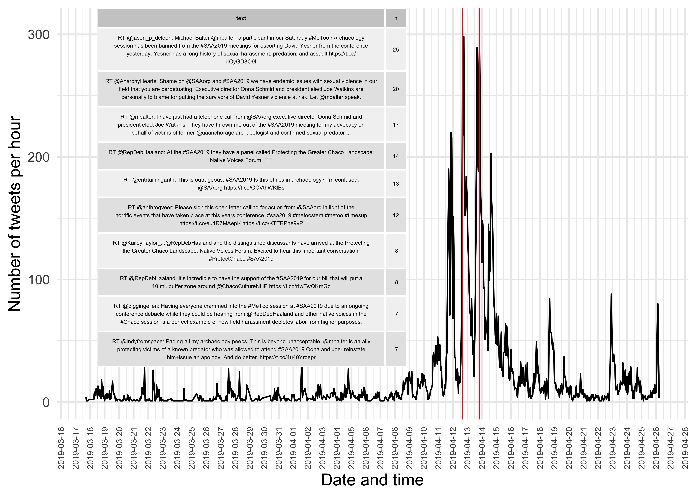
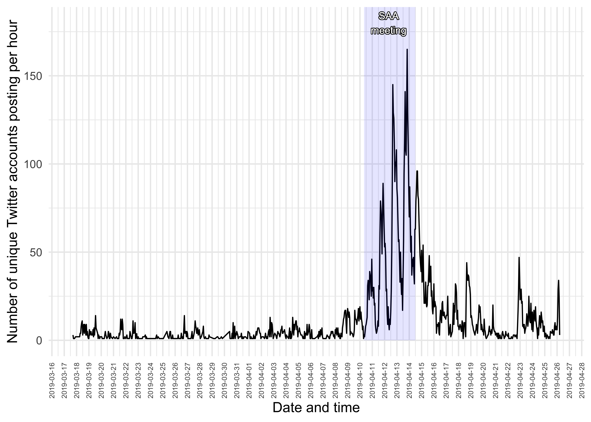
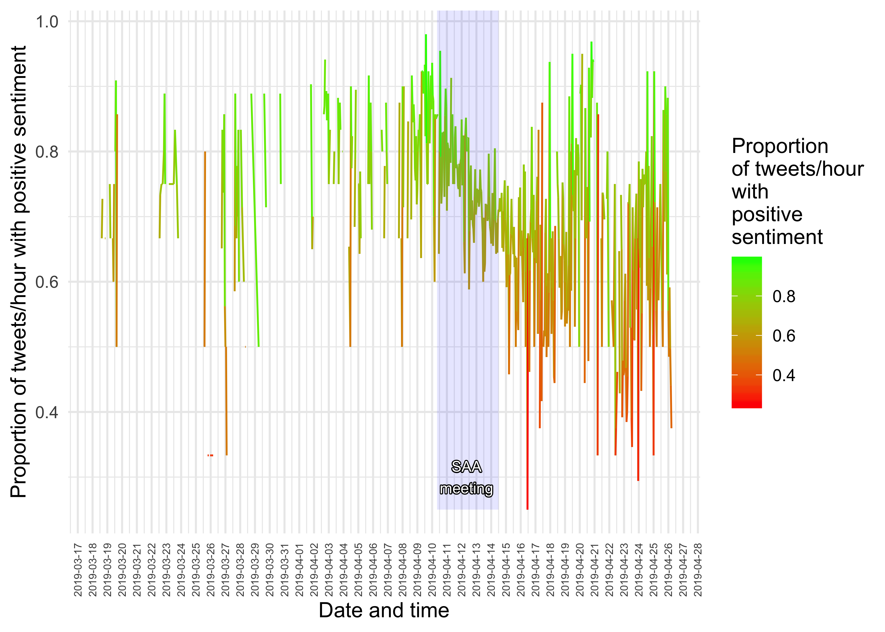
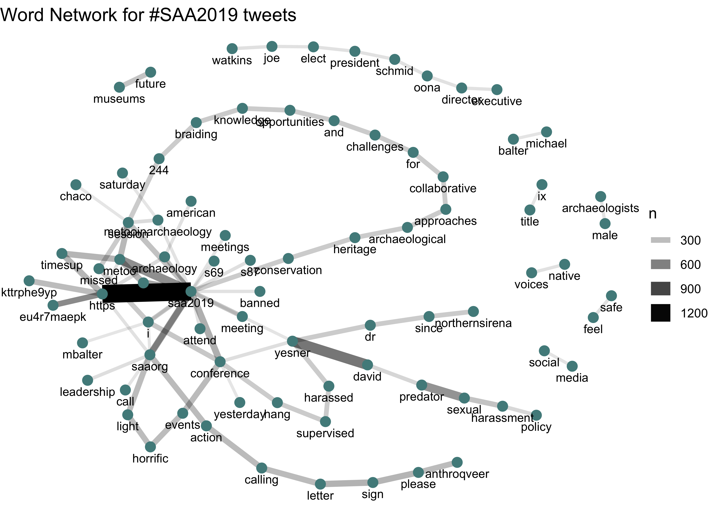

SAA2019 Exploratory Data Analysis
================

# Acquire the tweets from the TAGS Google sheet

``` r
library(googlesheets)
library(tidyverse)

tags_sheet <- "https://docs.google.com/spreadsheets/d/17EOoOeGllBxk5x9TS3vEc0zdUwmh_fL0abdEdrOz1Pg/edit#gid=400689247"

saa2019_tweet_archive <- 
tags_sheet %>% 
  gs_url() %>% 
    gs_read(ws = "Archive")

write_csv(saa2019_tweet_archive,
          "saa2019_tweet_archive.csv")
```

# Volume of tweets over time

The table inset in the plot shows the ten most retweeted tweets during
the two hours of the highest volume of tweets.

``` r
library(tidyverse)
library(lubridate)
```

    ## 
    ## Attaching package: 'lubridate'

    ## The following object is masked from 'package:base':
    ## 
    ##     date

``` r
library(gridExtra)
```

    ## 
    ## Attaching package: 'gridExtra'

    ## The following object is masked from 'package:dplyr':
    ## 
    ##     combine

``` r
library(shadowtext)

saa2019_tweet_archive <- 
read_csv("saa2019_tweet_archive.csv")
```

    ## Parsed with column specification:
    ## cols(
    ##   id_str = col_double(),
    ##   from_user = col_character(),
    ##   text = col_character(),
    ##   created_at = col_character(),
    ##   time = col_character(),
    ##   geo_coordinates = col_logical(),
    ##   user_lang = col_character(),
    ##   in_reply_to_user_id_str = col_double(),
    ##   in_reply_to_screen_name = col_character(),
    ##   from_user_id_str = col_double(),
    ##   in_reply_to_status_id_str = col_double(),
    ##   source = col_character(),
    ##   profile_image_url = col_character(),
    ##   user_followers_count = col_double(),
    ##   user_friends_count = col_double(),
    ##   user_location = col_character(),
    ##   status_url = col_character(),
    ##   entities_str = col_character()
    ## )

``` r
saa2019_tweet_archive_dttm <- 
saa2019_tweet_archive %>% 
  mutate(time_dttm = dmy_hms(time)) %>% 
  group_by(hour = floor_date(time_dttm, "hour")) 

saa2019_tweet_archive_dttm_hourly_counts <- 
saa2019_tweet_archive_dttm %>% 
  count()  

top_hours <- 
  saa2019_tweet_archive_dttm_hourly_counts %>% 
  arrange(desc(n)) %>% 
  ungroup %>% 
  slice(1:2)

saa2019_tweet_archive_dttm_top_hours <- 
saa2019_tweet_archive_dttm %>% 
  filter(hour %in% top_hours$hour) %>% 
  group_by(text) %>% 
  count(sort = TRUE) %>% 
  ungroup %>%
  mutate(text = str_wrap(text, 100)) %>% 
  slice(1:10)
  
  ggplot(saa2019_tweet_archive_dttm_hourly_counts,
         aes(hour, n)) +
  geom_line() +
  geom_vline(xintercept = top_hours$hour,
             colour = "red") +
  theme_minimal(base_size = 12) +
  scale_x_datetime(date_breaks = "1 day") +
  theme(axis.text.x = element_text(angle = 90, 
                                   hjust = 1, 
                                   vjust = 0.5,
                                   size = 6)) +
  labs(y = "Number of tweets per hour",
       x = "Date and time") +
  annotation_custom(tableGrob(saa2019_tweet_archive_dttm_top_hours,
                              rows=NULL,
                              theme = ttheme_default(base_size = 4)), 
                    xmin= ymd_hms("2019-03-18 16:00:00 UTC"), 
                    xmax= ymd_hms("2019-04-08 16:00:00 UTC"), 
                    ymin= 250, 
                    ymax= 100) +
    # shade SAA meeting days | April 10 - 14, 2019.
    annotate("rect", 
             xmin = ymd_hms("2019-04-10 08:00:00 UTC"),
             xmax = ymd_hms("2019-04-14 12:00:00 UTC"), 
             ymin = 0, 
             ymax = Inf, 
             alpha = 0.1,  
             fill = "blue") +
  geom_shadowtext(aes(label="SAA\nmeeting",
                      x = ymd_hms("2019-04-12 08:00:00 UTC"),
                      y = 310), size=3)
```



# Number of Twitter accounts using \#SAA2019

The total number of unique accounts in this data set is 3325.

Here are the top 50 twitter accounts in these data:

``` r
saa2019_tweet_archive_dttm_accounts_count <- 
  saa2019_tweet_archive_dttm %>% 
  ungroup %>% 
  count(from_user, sort = TRUE) 

saa2019_tweet_archive_dttm_accounts_count %>% 
  slice(1:50) %>% 
ggplot(aes(reorder(from_user, n), n)) +
  geom_col() +
  coord_flip() +
  theme_minimal(base_size = 10) +
  labs(y = "Number of tweets",
       x = "Top 50 Twitter accounts by volume") 
```


Here is the count of all twitter accounts active in each hour:

``` r
saa2019_tweet_archive_dttm_accounts <- 
  saa2019_tweet_archive_dttm %>% 
  group_by(hour) %>% 
  summarise(n_accounts = n_distinct(from_user))

  ggplot(saa2019_tweet_archive_dttm_accounts,
         aes(hour, n_accounts)) +
  geom_line() +
  theme_minimal(base_size = 12) +
  scale_x_datetime(date_breaks = "1 day") +
  theme(axis.text.x = element_text(angle = 90, 
                                   hjust = 1, 
                                   vjust = 0.5,
                                   size = 6)) +
  labs(y = "Number of unique Twitter accounts posting per hour",
       x = "Date and time")   +
# shade SAA meeting days | April 10 - 14, 2019.
    annotate("rect", 
             xmin = ymd_hms("2019-04-10 08:00:00 UTC"),
             xmax = ymd_hms("2019-04-14 12:00:00 UTC"), 
             ymin = 0, 
             ymax = Inf, 
             alpha = 0.1,  
             fill = "blue")  +
  geom_shadowtext(aes(label="SAA\nmeeting",
                      x = ymd_hms("2019-04-12 08:00:00 UTC"),
                      y = 180), size=3)
```



# Sentiment analysis

``` r
library(tidytext)

saa2019_tweet_archive_dttm_sentiment <- 
saa2019_tweet_archive_dttm %>% 
  ungroup %>% 
  # filter(time_dttm >= "2019-04-11 00:00:00" & time_dttm <= "2019-04-17 00:00:00" ) %>%
  select(text, hour) %>%
  mutate(text = str_remove(text, "\\brt\\b|\\bRT\\b|\\s?(f|ht)(tp)(s?)(://)([^\\.]*)[\\.|/](\\S*)|https://*")) %>% 
  mutate(text = tm::removeWords(text, c(stop_words$word, "the", "The")))  %>%
  unnest_tokens(word, text) %>% 
   inner_join(get_sentiments("nrc") %>% 
   filter(sentiment %in% c("positive",  "negative"))) 
```

    ## Joining, by = "word"

``` r
saa2019_tweet_archive_dttm_sentiment_tally <- 
saa2019_tweet_archive_dttm_sentiment %>% 
  group_by(hour, sentiment) %>% 
  tally() %>% 
  spread(sentiment, n) %>% 
  mutate(prop_positive_sentiment  = positive / (negative + positive) )

ggplot() +
  geom_line(data = saa2019_tweet_archive_dttm_sentiment_tally,
           aes(hour, prop_positive_sentiment,
           colour = prop_positive_sentiment))  +
  scale_color_continuous(low = "red", 
                         high = "green", 
                         name = "Proportion\nof tweets/hour\nwith \npositive\nsentiment") +
  labs(y = "Proportion of tweets/hour with positive sentiment",
       x = "Date and time") + 
  scale_x_datetime(date_breaks = "1 day") +
  theme_minimal(base_size = 12) +
  theme(axis.text.x = element_text(angle = 90, 
                                   hjust = 1, 
                                   vjust = 0.5,
                                   size = 6))   +
# shade SAA meeting days | April 10 - 14, 2019.
    annotate("rect", 
             xmin = ymd_hms("2019-04-10 08:00:00 UTC"),
             xmax = ymd_hms("2019-04-14 12:00:00 UTC"), 
             ymin = min(saa2019_tweet_archive_dttm_sentiment_tally$prop_positive_sentiment, 
                        na.rm = TRUE), 
             ymax = Inf, 
             alpha = 0.1,  
             fill = "blue") +
  geom_shadowtext(aes(label="SAA\nmeeting",
                      x = ymd_hms("2019-04-12 08:00:00 UTC"),
                      y = 0.3), size=3)
```

    ## Warning: Removed 2 rows containing missing values (geom_path).



World cloud organised by sentiment

``` r
library(reshape2)
```

    ## 
    ## Attaching package: 'reshape2'

    ## The following object is masked from 'package:tidyr':
    ## 
    ##     smiths

``` r
library(wordcloud)
```

    ## Loading required package: RColorBrewer

``` r
saa2019_tweet_archive_dttm_sentiment %>%
  count(word, sentiment, sort = TRUE) %>%
  acast(word ~ sentiment, value.var = "n", fill = 0) %>%
  comparison.cloud(colors = c("gray20", "gray80"),
                   max.words = 100)
```


# Co-occuring words

``` r
library(igraph)
```

    ## 
    ## Attaching package: 'igraph'

    ## The following objects are masked from 'package:lubridate':
    ## 
    ##     %--%, union

    ## The following objects are masked from 'package:dplyr':
    ## 
    ##     as_data_frame, groups, union

    ## The following objects are masked from 'package:purrr':
    ## 
    ##     compose, simplify

    ## The following object is masked from 'package:tidyr':
    ## 
    ##     crossing

    ## The following object is masked from 'package:tibble':
    ## 
    ##     as_data_frame

    ## The following objects are masked from 'package:stats':
    ## 
    ##     decompose, spectrum

    ## The following object is masked from 'package:base':
    ## 
    ##     union

``` r
library(ggraph)

saa2019_tweet_archive_dttm %>% 
  ungroup %>% 
  filter(time_dttm >= "2019-04-11 00:00:00" & time_dttm <= "2019-04-17 00:00:00" ) %>%
  select(text) %>%
  mutate(text = str_remove(text, "\\brt\\b|\\bRT\\b|\\s?(f|ht)(tp)(s?)(://)([^\\.]*)[\\.|/](\\S*)|https://*")) %>% 
  mutate(text = tm::removeWords(text, c(stop_words$word, "the", "The", "2019"))) %>%
  unnest_tokens(paired_words, text, token = "ngrams", n = 2) %>% 
  separate(paired_words, c("word1", "word2"), sep = " ") %>% 
  count(word1, word2, sort = TRUE) %>% 
  filter(n >= 100) %>%
  graph_from_data_frame() %>%
  ggraph(layout = "fr") +
  geom_edge_link(aes(edge_alpha = n, edge_width = n)) +
  geom_node_point(color = "darkslategray4", size = 3) +
  geom_node_text(aes(label = name), vjust = 1.8, size = 3) +
  labs(title = "Word Network for #SAA2019 tweets",
       x = "", y = "") +
  theme_void()
```


